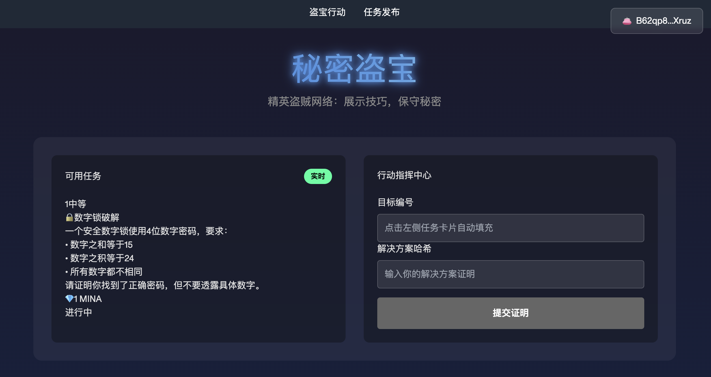
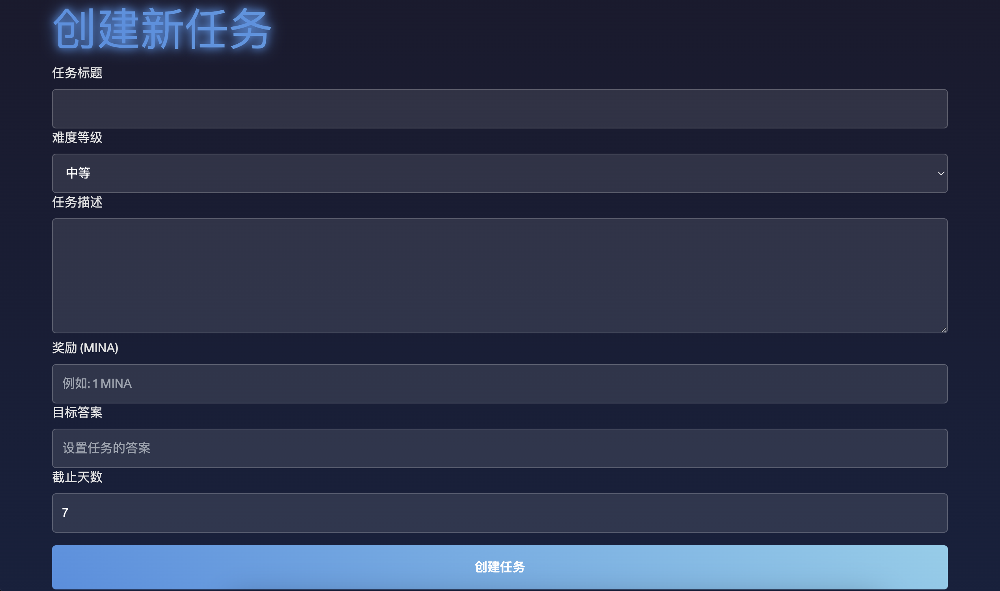

### 从 0 到 1：实现一个基于零知识证明的寻宝游戏

本教程指导你使用 **o1js 2.\*** 开发一个去中心化应用（DApp），构建一个基于零知识证明（ZKP）的寻宝游戏。游戏中，玩家扮演精英盗贼，需完成一系列盗宝任务。通过零知识证明，玩家可以向系统展示任务完成的真实性，同时保护任务细节（如密码、路线或地点等）。整个游戏采用去中心化架构，智能合约确保公平性，玩家之间可以竞争宝藏。

---

### **页面效果**

  


---

### **核心功能**

#### **任务逻辑**
1. **任务创建者**  
   - 定义任务目标（如密码哈希、地点哈希等）。  
   - 提供奖励金额和任务截止时间。  

2. **玩家**  
   - 完成任务后提交解决方案。  
   - 系统通过零知识证明验证任务完成的真实性，无需透露解决方案细节。

#### **零知识证明的价值**
- **隐私保护**：任务完成者无需公开细节即可证明完成情况。  
- **公平性**：去中心化验证过程避免作弊。  
- **灵活扩展**：任务类型可包含多种谜题形式，如密码破解或路线规划。

---

### **开发流程**

#### **1. 初始化项目**
使用 zkApp CLI 初始化项目并安装必要依赖。  

```bash
npm install -g zkapp-cli
zkapp-cli create secret-heist
cd secret-heist
npm install
```

---

#### **2. 实现合约**

##### **任务结构体定义**
定义任务结构体 `HeistTask`，用于存储任务信息。  

```javascript
class HeistTask {
  id: number;          // 任务ID
  target: Field;       // 目标哈希（如密码或位置的哈希值）
  reward: UInt64;      // 奖励金额
  deadline: UInt32;    // 截止时间
}
```

##### **验证任务解决方案的方法**
实现 `verifyTaskSolution` 方法，验证玩家提交的解决方案哈希是否匹配任务目标哈希。

```javascript
verifyTaskSolution(taskTarget: Field, solutionHash: Field): Bool {
  return taskTarget.equals(solutionHash);
}
```

##### **合约核心方法**
在 `SecretHeist` 合约中实现两个主要方法：  

###### **1. 创建任务：`createTask`**
玩家可以创建新任务并设置目标哈希、奖励金额和截止时间。  

- **输入参数**：
  - `target`: 目标哈希（密码哈希或位置哈希）  
  - `reward`: 奖励金额  
  - `deadline`: 截止时间  

- **主要逻辑**：
  1. 自动生成任务ID。
  2. 存储任务信息。
  3. 发出任务创建事件。

```typescript
// 创建新任务
  @method async createTask(target: Field, reward: Field, deadline: UInt64) {
    
    const currentCounter = this.taskCounter.get();
    this.taskCounter.requireEquals(this.taskCounter.get());
    const newTask = new HeistTask({
      id: currentCounter,
      target,
      reward,
      deadline,
    });
    
    // 更新状态
    this.tasks.set(newTask);
    this.taskCounter.set(currentCounter.add(1));
    
    // Emit task created event
    this.emitEvent('task-created', currentCounter);
  }
```

---

###### **2. 提交任务解决方案：`submitSolution`**
玩家完成任务后提交解决方案。

- **输入参数**：
  - `taskId`: 任务ID  
  - `solution`: 解决方案  

- **主要逻辑**：
  1. 验证任务是否存在且未过截止时间。
  2. 使用 `verifyTaskSolution` 方法验证解决方案是否正确。
  3. 更新任务状态并发出任务完成事件。

```typescript
// 提交任务解决方案
  @method async submitSolution(taskId: Field, solution: Field) {
    const task = this.tasks.get();
    this.tasks.requireEquals(this.tasks.get());
    // 确保任务存在且未完成
    task.id.assertEquals(taskId);
    
    // 验证当前时间是否在截止时间之前
    this.network.globalSlotSinceGenesis.requireEquals(this.network.globalSlotSinceGenesis.get());
    this.network.timestamp.get().lessThan(task.deadline).assertTrue();
    
    // 验证解决方案
    const isCorrect = task.verifyTaskSolution(solution);
    isCorrect.assertTrue();
    
    // 更新任务状态为已完成
    const completedTask = new HeistTask({
      ...task,
    });
    this.tasks.set(completedTask);
    
    // Emit solution submitted event before the method ends
    this.emitEvent('solution-submitted', taskId);
    
    // 这里可以添加奖励发放逻辑
  }
```

以下是优化后的内容，语言表达更加清晰，逻辑更加严谨：

---

### 三. 编写测试用例与部署合约

#### 1. 测试环境设置

```typescript
beforeEach(async () => {
    // 初始化本地区块链实例，关闭证明以提升测试速度
    const Local = await Mina.LocalBlockchain({ proofsEnabled: false });
    Mina.setActiveInstance(Local);

    // 获取测试账户及其密钥
    [deployerAccount, senderAccount] = Local.testAccounts;
    deployerKey = deployerAccount.key;
    senderKey = senderAccount.key;

    // 部署合约实例
    zkAppPrivateKey = PrivateKey.random();
    zkAppAddress = zkAppPrivateKey.toPublicKey();
    zkApp = new SecretHeist(zkAppAddress);

    // ... 在这里添加部署交易逻辑
});
```

#### 2. 测试用例分类

- **合约初始化**: 测试合约的初始状态是否正确  
- **任务创建**: 验证创建任务的功能是否按预期工作  
- **解决方案提交**:  
  - 正确解决方案：验证合约能成功接收并处理正确的解决方案  
  - 错误解决方案：验证合约对错误解决方案进行拒绝  

#### 3. 关键测试用例详解

##### (1) 测试任务创建功能

```typescript
it('should create a new task', async () => {
    // 准备测试数据
    const secret = Field(123);  // 密码
    const target = Poseidon.hash([secret]);  // 计算目标哈希
    const reward = Field(1000);  // 奖励
    const deadline = UInt64.from(Date.now() + 3600000);  // 截止时间为1小时后

    // 发起任务创建交易
    const txn = await Mina.transaction(deployerAccount, async () => {
        await zkApp.createTask(target, reward, deadline);
    });
    await txn.prove();
    await txn.sign([deployerKey]).send();

    // 验证任务是否成功创建
    const taskCounter = await zkApp.taskCounter.get();
    const task = await zkApp.tasks.get();

    expect(taskCounter).toEqual(Field(1));  // 任务计数器应更新
    expect(task.target).toEqual(target);  // 验证任务哈希
    expect(task.reward).toEqual(reward);  // 验证奖励
    expect(task.deadline).toEqual(deadline);  // 验证截止时间
});
```

##### (2) 测试提交正确的解决方案

```typescript
it('should successfully submit correct solution', async () => {
    // 创建测试任务
    const secret = Field(123);
    const target = Poseidon.hash([secret]);
    // ... 任务创建逻辑

    // 提交正确解决方案
    const txn = await Mina.transaction(senderAccount, async () => {
        await zkApp.submitSolution(Field(0), secret);  // 使用正确的secret
    });
    await txn.prove();
    await txn.sign([senderKey]).send();

    // 验证任务状态更新
    const task = await zkApp.tasks.get();
    expect(task.id).toEqual(Field(0));  // 验证任务ID
});
```

##### (3) 测试提交错误的解决方案

```typescript
it('should fail when submitting wrong solution', async () => {
    // 创建测试任务
    // ... 任务创建逻辑
    const wrongSolution = Field(456);  // 模拟错误的解决方案

    // 验证提交错误解决方案时交易失败
    await expect(async () => {
        const txn = await Mina.transaction(senderAccount, async () => {
            await zkApp.submitSolution(Field(0), wrongSolution);  // 使用错误的解决方案
        });
        await txn.prove();
        await txn.sign([senderKey]).send();
    }).rejects.toThrow();  // 预期抛出错误
});
```

#### 4. 核心功能验证

上述测试用例全面覆盖了合约的关键功能，确保：

1. 合约初始化状态正确，能够正常运行；
2. 能创建新任务并存储相关信息；
3. 对正确的解决方案进行处理；
4. 拒绝错误的解决方案，保证合约逻辑安全性。

以下是补充和完善后的内容，确保表达清晰、逻辑严谨：

---

### 四、部署到 Devnet

#### 1. 配置 Devnet 环境

在部署合约到 Devnet 之前，需要确保正确配置网络环境。`zk config` 提供了配置工具，可以方便地设置相关参数。

1. **运行 `zk config`**：执行以下命令以进入 Devnet 配置界面：  
   ```bash
   zk config
   ```

2. **设置 Devnet 参数**：在配置过程中，主要填写以下关键信息：  
   - **Network**: 选择 `devnet` 网络。  
   - **Node URL**: 输入 Devnet 节点的 URL（通常由 Mina 网络提供）。  
   - **Private Key**: 提供部署账户的私钥，用于签署交易。  
   - **Fee**: 设置交易的手续费，根据网络要求填写适当值。

3. **验证配置**：完成设置后，可运行以下命令查看当前的配置是否正确：  
   ```bash
   zk config show
   ```

   输出应包含 `devnet` 网络的相关参数，如节点地址和账户信息。

#### 2. 部署合约到 Devnet

完成配置后，使用以下命令将合约部署到 Devnet：  

```bash
zk deploy devnet
```

部署成功后，终端会返回合约地址（通常是公共密钥 `zkAppAddress`）。记录此地址，后续测试将用到。  

以下是优化后的内容，提升了表达的清晰度和逻辑性：

---

### 五、实现前端页面

实现两个页面：  
1. **创建任务页面**：用于用户填写表单并提交创建任务请求。  
2. **进行任务页面**：用于显示任务详情并允许用户提交解决方案。

以下详细说明 **创建任务页面** 的主要功能与实现：

---

#### 1. **状态管理**

```typescript
const [taskData, setTaskData] = useState({
  title: '',
  difficulty: '中等',
  description: '',
  reward: '',
  target: '',
  deadline: 7, // 默认截止时间为 7 天
});
const [loading, setLoading] = useState(false); // 加载状态
const [error, setError] = useState(''); // 错误信息
```

- 使用 `useState` 管理任务表单数据 (`taskData`)、加载状态 (`loading`) 和错误提示 (`error`)。
- `taskData` 包含了创建任务所需的所有字段，便于统一管理表单数据。

---

#### 2. **钱包连接功能**

```typescript
const { wallet, setWallet } = useWallet(); // 使用上下文管理钱包状态

const handleConnectWallet = async () => {
  try {
    const account = await connectAuroWallet(); // 调用 Auro 钱包的连接方法
    if (account) {
      setWallet(account); // 成功连接后保存钱包地址
    } else {
      throw new Error('钱包连接失败');
    }
  } catch (err) {
    setError(err.message || '无法连接钱包');
  }
};
```

- 通过 `connectAuroWallet` 与 Auro 钱包建立连接。
- 成功连接后，保存用户的 `wallet` 地址，供后续交易使用。
- 在连接失败时，捕获并显示错误信息。

---

#### 3. **表单提交处理**

```typescript
const handleSubmit = async (e: React.FormEvent) => {
  e.preventDefault();
  
  if (!wallet) {
    setError('请先连接 Auro 钱包');
    await handleConnectWallet(); // 引导用户连接钱包
    return;
  }

  setLoading(true); // 开始加载状态
  try {
    // 初始化 Mina 网络实例
    const network = Mina.Network({
      mina: 'https://api.minascan.io/node/devnet/v1/graphql/',
      archive: 'https://api.minascan.io/archive/devnet/v1/graphql/',
    });
    Mina.setActiveInstance(network);

    // 构造任务数据
    const rewardAmount = Field(taskData.reward);
    const deadlineTimestamp = UInt64.from(Date.now() + taskData.deadline * 86400000); // 以天为单位计算截止时间
    const targetHash = Poseidon.hash([Field(taskData.target)]); // 计算任务目标哈希

    // 创建并发送交易
    const tx = await Mina.transaction(PublicKey.fromBase58(wallet), async () => {
      await zkApp.createTask(targetHash, rewardAmount, deadlineTimestamp);
    });

    await tx.prove(); // 生成证明
    const { hash } = await tx.sign([PrivateKey.fromBase58(wallet)]).send(); // 签名并发送交易
    console.log(`交易成功，哈希值为: ${hash}`);
  } catch (err) {
    setError(err.message || '任务创建失败');
  } finally {
    setLoading(false); // 无论成功或失败都结束加载状态
  }
};
```

- **验证钱包连接**：表单提交时，检查用户是否已连接钱包，未连接时提示并自动引导连接。  
- **任务数据处理**：根据用户输入的数据生成任务哈希 (`targetHash`) 和截止时间 (`deadlineTimestamp`)。  
- **智能合约交互**：创建并发送任务到区块链，通过 Mina 网络的 `zkApp.createTask` 方法完成操作。  
- **错误处理**：捕获所有可能的错误并更新 `error` 状态，便于在 UI 上展示。

---

#### 4. **UI 渲染**

```typescript
return (
  <div className={styles.container}>
    <Head>
      <title>创建任务</title>
    </Head>
    <main className={styles.main}>
      <div className={styles.taskContainer}>
        {/* 钱包连接区域 */}
        <div className={styles.walletSection}>
          <button onClick={handleConnectWallet}>
            {wallet ? `已连接：${wallet}` : '连接钱包'}
          </button>
        </div>

        {/* 创建任务表单 */}
        <form onSubmit={handleSubmit} className={styles.createTaskForm}>
          {/* 表单字段 */}
          <div className={styles.formGroup}>
            <label htmlFor="title">任务标题</label>
            <input
              id="title"
              value={taskData.title}
              onChange={(e) =>
                setTaskData({ ...taskData, title: e.target.value })
              }
              required
            />
          </div>
          <div className={styles.formGroup}>
            <label htmlFor="difficulty">难度</label>
            <select
              id="difficulty"
              value={taskData.difficulty}
              onChange={(e) =>
                setTaskData({ ...taskData, difficulty: e.target.value })
              }
            >
              <option value="简单">简单</option>
              <option value="中等">中等</option>
              <option value="困难">困难</option>
            </select>
          </div>
          {/* 其他输入字段省略... */}

          {/* 提交按钮 */}
          <button type="submit" disabled={loading}>
            {loading ? '创建中...' : '创建任务'}
          </button>
        </form>

        {/* 错误信息提示 */}
        {error && <div className={styles.error}>{error}</div>}
      </div>
    </main>
  </div>
);
```

- **钱包连接区域**：提供按钮引导用户连接钱包，成功连接后显示钱包地址。  
- **任务表单**：通过表单输入任务信息，包括标题、难度、奖励、目标等字段。  
- **错误提示**：显示捕获的错误信息，帮助用户了解问题所在。  
- **样式管理**：使用 CSS Modules 管理样式文件（`styles.*`），保持组件样式隔离。


以下是优化后的内容，以更清晰的表达和更严谨的逻辑呈现 **进行任务页面的主要功能和实现**：

---

### **进行任务页面：主要功能与实现**

#### **1. 状态管理**

```typescript
const [taskId, setTaskId] = useState<string>(''); // 当前选中任务的ID
const [solution, setSolution] = useState<string>(''); // 用户输入的解决方案
const [loading, setLoading] = useState<boolean>(false); // 加载状态
const [taskList, setTaskList] = useState<any[]>([]); // 可选任务列表
const [selectedTask, setSelectedTask] = useState<any>(null); // 当前选中的任务详情
const [wallet, setWallet] = useState<string | null>(null); // 用户钱包地址
const [error, setError] = useState<string>(''); // 错误提示信息
```

- 使用 `useState` 管理页面核心状态：任务选择、解决方案输入、任务列表和加载状态。
- `wallet` 用于保存用户钱包地址，`error` 用于捕获和显示错误信息。

---

#### **2. 合约初始化**

```typescript
useEffect(() => {
  (async () => {
    try {
      const { Mina, PublicKey } = await import('o1js');
      const { SecretHeist } = await import('../lib/contracts');

      const zkAppAddress = 'B62qr...'; // 智能合约地址
      const zkApp = new SecretHeist(PublicKey.fromBase58(zkAppAddress));

      // 可根据需要设置 Mina 网络实例
      const network = Mina.Network({
        mina: 'https://api.minascan.io/node/devnet/v1/graphql/',
        archive: 'https://api.minascan.io/archive/devnet/v1/graphql/',
      });
      Mina.setActiveInstance(network);

      // 后续交互中可直接使用 zkApp
    } catch (error) {
      setError('合约初始化失败，请检查网络连接或合约地址');
    }
  })();
}, []);
```

- 在组件加载时，通过 `useEffect` 初始化 Mina 网络连接和智能合约实例。
- 捕获合约初始化过程中的错误并更新 `error` 状态。

---

#### **3. 任务选择处理**

```typescript
const handleTaskSelect = (task: any) => {
  setSelectedTask(task); // 更新选中任务详情
  setTaskId(task.id); // 设置当前任务ID
  setError(''); // 清除错误提示
};
```

- 处理任务选择逻辑：更新选中任务的状态，并清空之前可能的错误信息。

---

#### **4. 解决方案提交**

```typescript
const handleSubmitSolution = async () => {
  if (!wallet || !taskId || !solution) {
    setError('请确保已连接钱包并填写完整信息');
    return;
  }

  setLoading(true); // 开启加载状态
  setError(''); // 清空错误提示
  try {
    // 初始化 Mina 网络
    const network = Mina.Network({
      mina: 'https://api.minascan.io/node/devnet/v1/graphql/',
      archive: 'https://api.minascan.io/archive/devnet/v1/graphql/',
    });
    Mina.setActiveInstance(network);

    // 构造并发送解决方案交易
    const tx = await Mina.transaction(PublicKey.fromBase58(wallet), async () => {
      await zkApp.submitSolution(Field(taskId), Field(solution)); // 提交任务ID和解决方案
    });

    await tx.prove(); // 生成零知识证明
    const { hash } = await tx.sign([PrivateKey.fromBase58(wallet)]).send(); // 签名并发送交易

    console.log(`解决方案提交成功，交易哈希：${hash}`);
  } catch (err: any) {
    setError(err.message || '解决方案提交失败');
  } finally {
    setLoading(false); // 关闭加载状态
  }
};
```

- **验证用户输入**：确保用户已连接钱包并填写任务ID和解决方案。  
- **交互逻辑**：通过智能合约方法 `zkApp.submitSolution` 提交解决方案，生成证明并签名交易。  
- **错误处理**：捕获并显示异常信息，同时通过 `finally` 确保加载状态正确关闭。

---

#### **5. UI 结构**

```typescript
return (
  <div className={styles.container}>
    {/* 头部区域 */}
    <header className={styles.header}>
      <h1>秘密盗宝任务系统</h1>
      <button onClick={handleConnectWallet}>
        {wallet ? `已连接: ${wallet}` : '连接钱包'}
      </button>
    </header>

    {/* 游戏主区域 */}
    <main className={styles.main}>
      <div className={styles.taskPanel}>
        {/* 任务列表 */}
        <h2>可选任务</h2>
        {taskList.length > 0 ? (
          taskList.map((task) => (
            <div
              key={task.id}
              className={`${styles.taskCard} ${
                selectedTask?.id === task.id ? styles.selected : ''
              }`}
              onClick={() => handleTaskSelect(task)}
            >
              <h3>{task.title}</h3>
              <p>奖励: {task.reward} TOKEN</p>
              <p>截止时间: {new Date(task.deadline).toLocaleString()}</p>
            </div>
          ))
        ) : (
          <p>暂无任务</p>
        )}
      </div>

      <div className={styles.actionPanel}>
        {/* 解决方案提交 */}
        <h2>提交解决方案</h2>
        {selectedTask ? (
          <div className={styles.solutionForm}>
            <label htmlFor="solution">解决方案:</label>
            <input
              id="solution"
              value={solution}
              onChange={(e) => setSolution(e.target.value)}
            />
            <button
              onClick={handleSubmitSolution}
              disabled={loading || !wallet || !solution}
            >
              {loading ? '提交中...' : '提交解决方案'}
            </button>
          </div>
        ) : (
          <p>请选择一个任务以提交解决方案</p>
        )}
      </div>
    </main>
  </div>
);
```

- **双栏布局**：左侧显示任务列表，右侧显示当前选中任务的解决方案提交表单。  
- **任务卡片设计**：高亮选中的任务，提供清晰的任务信息展示（如奖励和截止时间）。  
- **动态交互**：根据任务选择动态渲染提交表单，优化用户体验。


### 六、遗留问题：
在点击create task时，会报错，提示Couldn't send zkApp command: (invalid (Invalid_proof "In progress"))。
